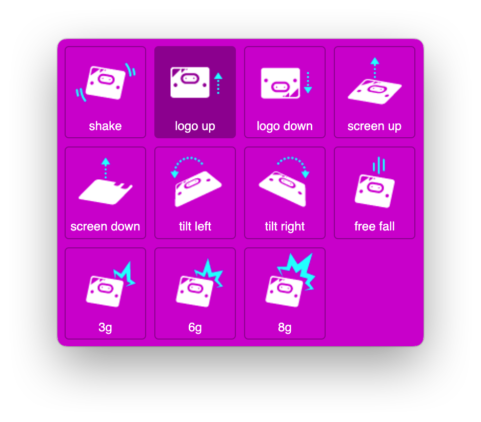
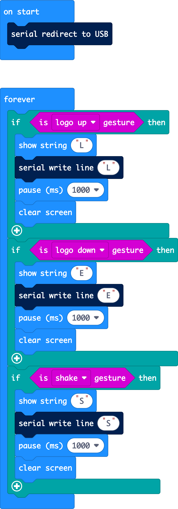

# Micro:bit bewegingssensor <br> voor besturing van CSS animaties,<br> video of audio in HTML pagina's



Bestanden **downloaden** naar je laptop? [Klik hier](https://github.com/CMD-Groningen/microbit_als_besturing_voor_html/archive/refs/heads/master.zip)     

Dit is een werkend voorbeeld inclusief instructies over hoe je een microbit als input kan gebruiken om apparaten buiten de micro:bit te bedienen. Door bijvoorbeeld in dit geval de microbit te schudden of ondersteboven te draaien, kun je videos, animaties of mp3 audio afspelen in de browser op je laptop of tablet. De micro:bit is dan de input en de laptop of tablet de output.

Door deze stappen te volgen, kun je de micro:bit gebruiken om interacties in bijvoorbeeld een webpagina te besturen, wat een leuke manier is om fysieke input en bediening te integreren met laptop of tablet en interface design. 

### Wat zit er in de download?

- **HTML en CSS** 
  - De HTML-pagina bevat een div (`#animate`) en een knop (`#connectButton`).
  - De CSS code bevat verschillende CSS classes (`grijs`, `groen`, `blauw`, `shake`) voor de div met bijbehorende animaties.
- **JavaScript** 
  - Controleert of de browser de Web Serial API ondersteunt.
  - Beheert de verbinding met de micro:bit via de seriële USB poort.
  - Leest data van de micro:bit en verwerkt deze om de CSS classes op de DIV te wijzigen, wat verschillende animaties activeert.
  - Laat de DIV "dansen" en speelt een geluid af bij de `Shake`-actie.
- **Micro:bit code**
  - Stuurt seriële USB data naar de computer gebaseerd op gedetecteerde gebaren input van de Micro:bit (`LogoUp`, `LogoDown`, `Shake`).

## Wat heb je nodig?

- Een computer met een moderne webbrowser die de Web Serial API ondersteunt (bijv. Google Chrome).
- Een micro:bit (versie 2 heeft de voorkeur, maar versie 1 kan ook) met USB-kabel.
- Een **HTML pagina** met code voor de browser 
- een **HEX bestand** met code voor de Micro:bit
- en een geluidsbestandje genaamd **disco.mp3**

De HTML pagina, de HEX file en het MP3 geluidsbestandje zijn alle drie meegeleverd als je dit Github project download naar je laptop! > klik hier

## Stappen

### Voorbereiding van de Micro:bit:

1. Open de Makecode editor op https://makecode.microbit.org/
2. Kopieer onderstaande microbit code naar de editor:

- Klik op `New Project`.

- Voeg de volgende code toe in de JavaScript of Blok modus  (je kunt bovenin de editor kiezen tussen Blocks of JavaScript invoer)

- Deze code zorgt ervoor dat input die je maakt op de micro:bit niet alleen naar het LED schermpje, maar ook via de USB kabel naar je laptop toegestuurd word (PS. dit is de microbit code ook in het HEX bestand zit)

  ```javascript
  serial.redirectToUSB()
  basic.forever(function () {
      if (input.isGesture(Gesture.LogoUp)) {
          basic.showString("L")
          serial.writeLine("L")
          basic.pause(1000)
          basic.clearScreen()
      }
      if (input.isGesture(Gesture.LogoDown)) {
          basic.showString("E")
          serial.writeLine("E")
          basic.pause(1000)
          basic.clearScreen()
      }
      if (input.isGesture(Gesture.Shake)) {
          basic.showString("S")
          serial.writeLine("S")
          basic.pause(1000)
          basic.clearScreen()
      }
  })
  ```
Als je de code in de Micro:bit editor hebt geplakt, ziet het er als blokstructuur zo uit:



### Upload de code naar de micro:bit

- Sluit de micro:bit aan op je computer via de USB-kabel.
- Je kunt op de paarse "download" button helemaal links onderin de editor klikken om de code naar je micro:bit te kopiëren.
- Je kunt de code ook op een andere manier op je microbit opslaan, namelijk:
- download de `.hex` file naar je computer.
- Sleep de gedownloade `.hex` file naar de micro:bit drive die op je computer verschijnt.

### Voorbereiding van de HTML-pagina

1. Maak een HTML bestand aan op de volgende manier:

   - Maak een leeg mapje/folder aan en open deze in VsCode.
   - Maak een bestand aan genaamd **index.html** en kopieer de gegeven HTML-code hieronder in dit nieuw bestand.
   - Voeg het **geluidsbestand** (disco.mp3) toe in diezelfde folder. Dus zorg ervoor dat je een geluidsbestand genaamd `disco.mp3` hebt en plaats dit in dezelfde directory als de `index.html`.

```html
<!DOCTYPE html>
<html lang="en">

<head>
    <meta charset="UTF-8">
    <meta name="viewport" content="width=device-width, initial-scale=1.0">
    <title>Micro:bit CSS Animatie</title>
    <style>
        * {
            margin: 20px;
        }

        .grijs {
            width: 300px;
            height: 300px;
            background-color: grey;
        }

        .groen {
            background-color: green;
            animation-name: zoom;
            animation-duration: .5s;
            transform-origin: center;
            transition: all 1s;
        }

        .blauw {
            background-color: blue;
            animation-name: zoom;
            animation-duration: .5s;
            transform-origin: center;
            transition: all 1s;
        }

        .shake {
            animation-name: shake;
            animation-duration: .3s;
            animation-timing-function: linear;
            animation-iteration-count: infinite;
            animation-direction: alternate;
            transform-origin: center;
            transition: all 1s;
        }

        @keyframes zoom {
            0% {
                transform: scale(1);
            }

            50% {
                transform: scale(1.5);
            }

            100% {
                transform: scale(1);
            }
        }

        @keyframes shake {
            0% {
                transform: translate(0, 0);
            }

            50% {
                transform: translate(150px, 40px);
            }

            100% {
                transform: translate(300px, 0);
            }
        }
    </style>
</head>

<body>
    <div id="animate" class="grijs"></div>
    <button id="connectButton">Verbinden met micro:bit</button>
    <audio id="shakeSound" src="disco.mp3" preload="auto"></audio>
    <script>
        // Check if the browser supports Web Serial API
        if ("serial" in navigator) {
            const animateDiv = document.getElementById('animate');
            const connectButton = document.getElementById('connectButton');
            const shakeSound = document.getElementById('shakeSound');

            async function connect() {
                try {
                    // Request serial port
                    const port = await navigator.serial.requestPort();
                    await port.open({ baudRate: 115200 }); // Ensure baud rate matches

                    console.log("Connected to the micro:bit");

                    // Read data from micro:bit
                    const decoder = new TextDecoderStream();
                    const inputDone = port.readable.pipeTo(decoder.writable);
                    const inputStream = decoder.readable;

                    const reader = inputStream.getReader();
                    let buffer = '';

                    while (true) {
                        const { value, done } = await reader.read();
                        if (done) {
                            // Reader closed
                            console.log("Reading from serial port ended");
                            break;
                        }
                        buffer += value;
                        let lines = buffer.split('\n');
                        buffer = lines.pop(); // Keep the last partial line in the buffer
                        for (let line of lines) {
                            console.log("Data received from micro:bit: ", line);
                            processData(line.trim());
                        }
                    }
                } catch (error) {
                    console.error("Error connecting to the micro:bit: ", error);
                }
            }

            function processData(data) {
                const animateDiv = document.getElementById('animate');
                const shakeSound = document.getElementById('shakeSound');

                switch (data) {
                    case "L":
                        // Switch animation class
                        shakeSound.pause();
                        shakeSound.currentTime = 0;
                        animateDiv.classList.remove('blauw');
                        animateDiv.classList.remove('shake');
                        void animateDiv.offsetWidth; // Force reflow for animation
                        animateDiv.classList.add('groen');
                        break;
                    case "E":
                        // Switch animation class
                        shakeSound.pause();
                        shakeSound.currentTime = 0;
                        animateDiv.classList.remove('groen');
                        animateDiv.classList.remove('shake');
                        void animateDiv.offsetWidth; // Force reflow for animation
                        animateDiv.classList.add('blauw');
                        break;
                    case "S":
                        // Switch animation class
                        void animateDiv.offsetWidth; // Force reflow for animation
                        animateDiv.classList.add('shake');
                        shakeSound.play();
                        break;
                    default:
                        // Handle unknown command or data
                        console.log("Unknown command or data received: ", data);
                }
            }

            // Add event listener to connect when the button is clicked
            connectButton.addEventListener('click', connect);
        } else {
            console.log("Web Serial API is not supported in this browser.");
        }
    </script>

</body>

</html>
```
     

### Uitvoeren in de browser

1. **Open de HTML-pagina in je browser**:
   - Dubbelklik op `index.html` om deze in je standaardwebbrowser te openen. Zorg ervoor dat je een browser gebruikt die de Web Serial API ondersteunt (zoals Google Chrome).
2. **Verbind de micro:bit met de browser**:
   - Klik op de button "Verbinden met micro:bit" op de geopende HTML-pagina.
   - Er verschijnt een pop-up waarin je de micro:bit kunt selecteren. Kies de micro:bit en klik op `Connect`.
   - Rechtsklik in de HTML pagina en kies in het dropdownmenu voor **inspect** om de Google Chrome code inspector te openen. In het tabblad van de **console** kun je precies zien wat er van moment tot moment gebeurt op de achtergrond terwijl de micro:bit met de browser communiceert!

### Interactie met de micro:bit en de HTML pagina

- Zodra de verbinding is gemaakt, kun je de micro:bit verschillende gebaren laten detecteren:
  - **Logo omhoog (Logo Up)**: De div verandert naar een groene achtergrond en wordt vergroot en verkleind.
  - **Logo omlaag (Logo Down)**: De div verandert naar een blauwe achtergrond en wordt vergroot en verkleind.
  - **Schudden (Shake)**: De div begint te schudden en het geluid `disco.mp3` wordt afgespeeld.

----------------------
**David van den Bor**  


Docent Communicatie & Multimedia Design @ Hanzehogeschool Groningen  
d.b.p.van.den.bor@pl.hanze.nl  

https://github.com/CMD-Groningen  
https://github.com/davidvandenbor
